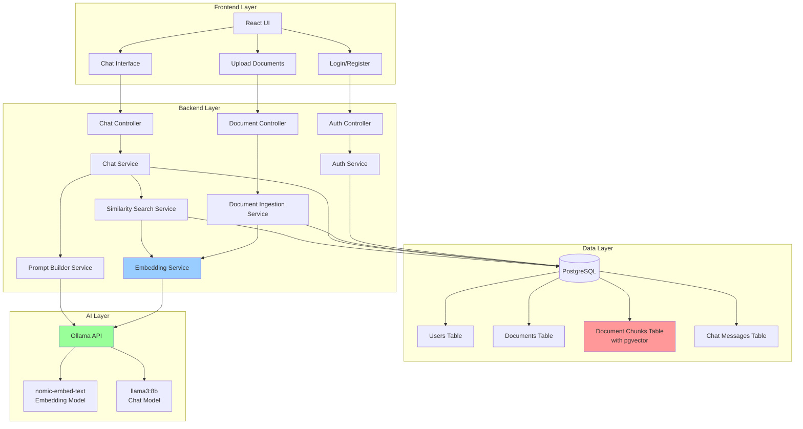
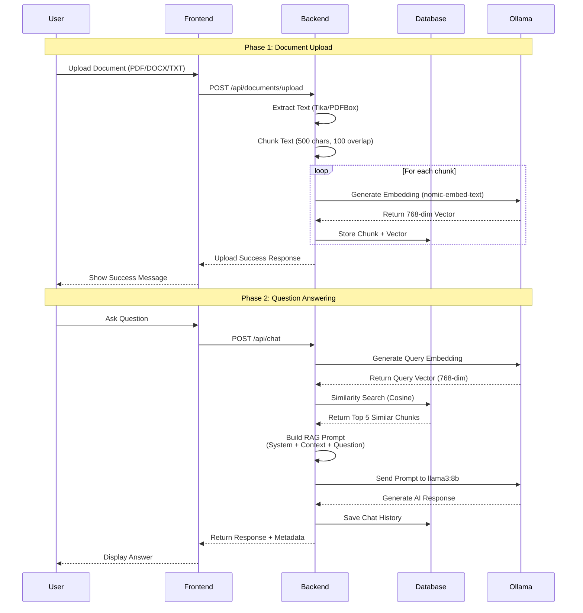
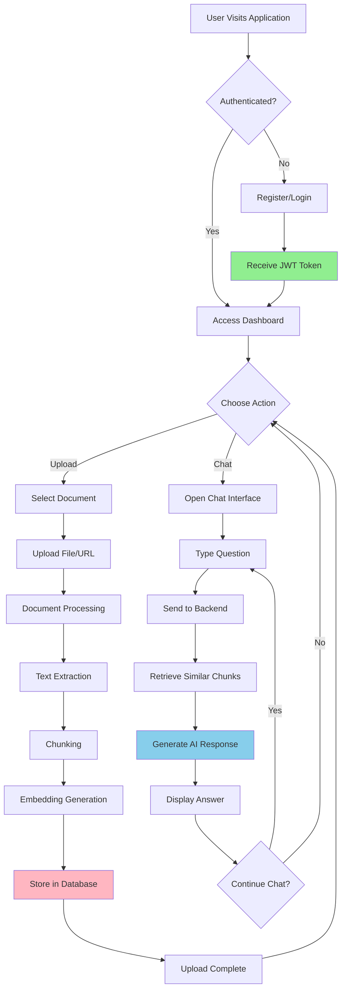
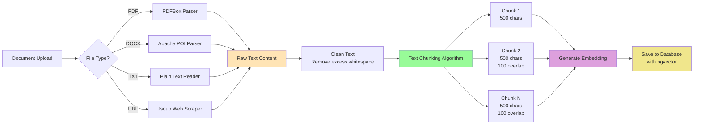
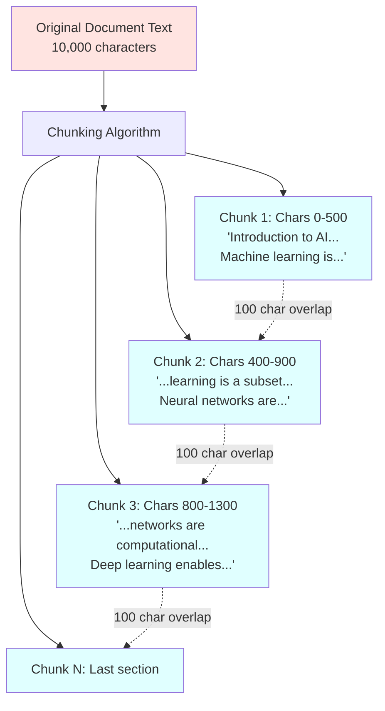
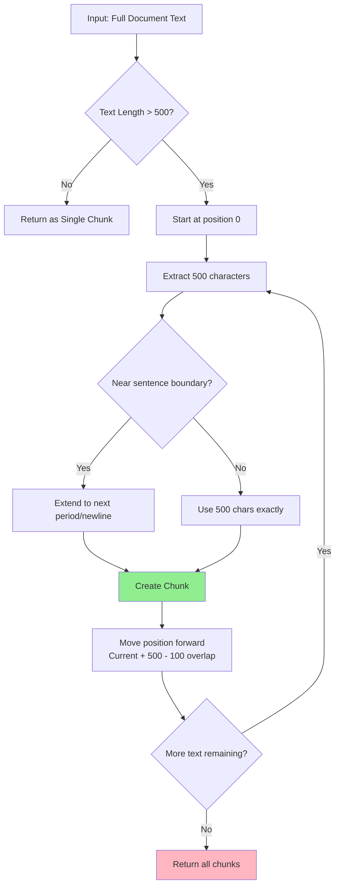
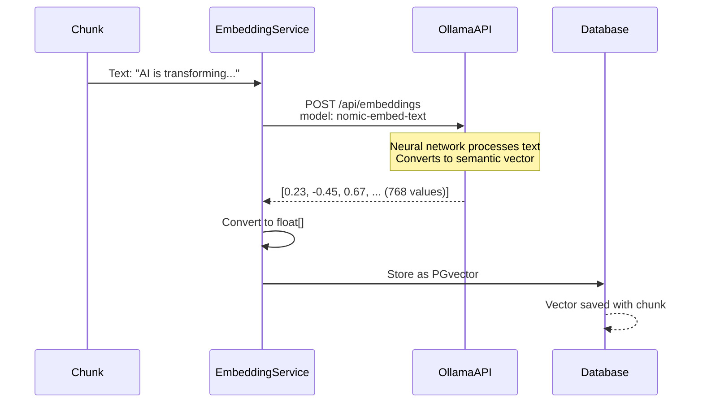
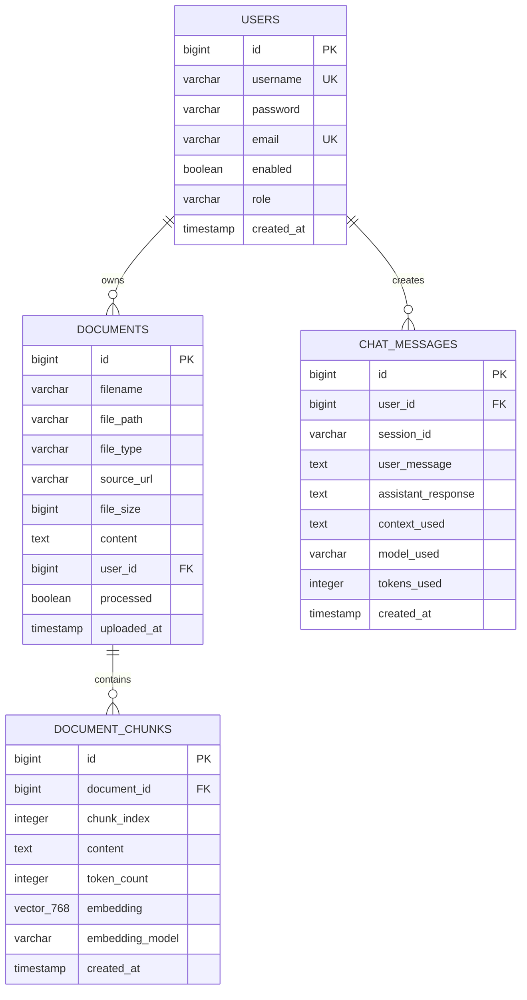
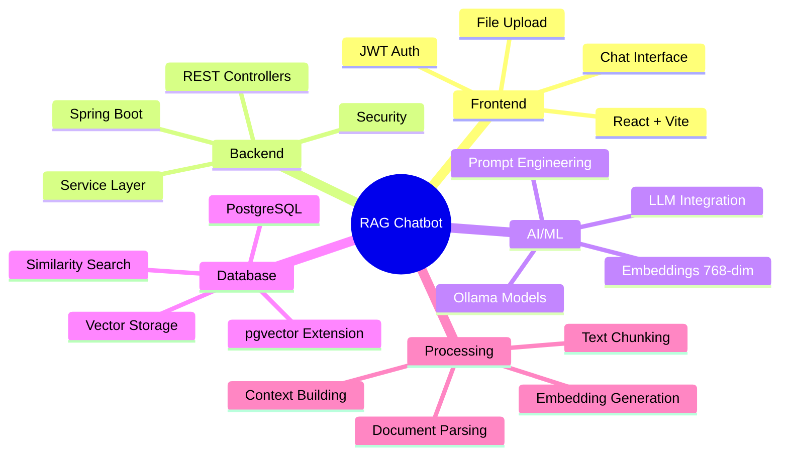

# RAG Chatbot - Complete Technical Documentation

## Table of Contents
1. [Project Overview](#project-overview)
2. [System Architecture](#system-architecture)
3. [Workflow Diagrams](#workflow-diagrams)
4. [Document Processing Pipeline](#document-processing-pipeline)
5. [Chunking Strategy](#chunking-strategy)
6. [Embedding Process](#embedding-process)
7. [Vector Storage & Similarity Search](#vector-storage--similarity-search)
8. [Database Schema](#database-schema)
9. [API Endpoints](#api-endpoints)
10. [Interview Talking Points](#interview-talking-points)

---

## Project Overview

**RAG (Retrieval-Augmented Generation) Personal Chatbot** - A full-stack application that enables users to upload documents and query them using AI, combining document retrieval with large language models for accurate, context-aware responses.

### Key Technologies
- **Backend:** Spring Boot 3.2.2, Java 17
- **Database:** PostgreSQL with pgvector extension
- **AI Models:** Ollama (llama3:8b for chat, nomic-embed-text for embeddings)
- **Frontend:** React + Vite
- **Security:** JWT Authentication
- **Document Processing:** Apache Tika, PDFBox, POI

---

## System Architecture



---

## Workflow Diagrams

### 1. Complete RAG Workflow (End-to-End)



### 2. User Journey Flow



---

## Document Processing Pipeline

### Step-by-Step Processing Flow



### Document Processing Details

**Supported Formats:**
- PDF (Apache PDFBox)
- DOCX/DOC (Apache POI)
- TXT (Plain Text)
- Markdown (Flexmark)
- Web URLs (Jsoup)

**Processing Stats Example:**
- 10-page PDF → ~5,000+ words → ~50-100 chunks
- Each chunk: 500 characters (≈125 tokens)
- Overlap: 100 characters to maintain context

---

## Chunking Strategy

### Visual Representation of Text Chunking



### Chunking Algorithm Details



**Why Chunking?**
- LLMs have token limits (can't process entire documents)
- Smaller chunks = more precise retrieval
- Overlap ensures no context loss at boundaries
- Sentence-based splitting maintains semantic coherence

**Configuration:**
```java
Default Chunk Size: 500 characters
Default Overlap: 100 characters
Minimum Chunk: > 0 characters (after trimming)
Boundary Detection: . ? ! \n
```

---

## Embedding Process

### How Embeddings Work

```mermaid
graph LR
    A[Text Chunk<br/>'Machine learning is<br/>a subset of AI'] --> B[Tokenization]
    B --> C[Token IDs<br/>[234, 891, 445, ...]]
    C --> D[Embedding Model<br/>nomic-embed-text]
    D --> E[768-Dimensional Vector<br/>[0.234, -0.891, 0.445, ..., 0.123]]
    
    E --> F[Vector represents<br/>semantic meaning]
    F --> G[Stored in PostgreSQL<br/>as pgvector type]
    
    style A fill:#FFE4B5
    style D fill:#98FB98
    style E fill:#DDA0DD
    style G fill:#87CEEB
```

### Embedding Generation Flow



### Vector Dimensions Visualization

```
Single Embedding Vector (768 dimensions):

Dimension:  1      2      3      4     ...    768
Values:   [0.234, -0.891, 0.445, 0.123, ..., 0.567]
           ↑
     Represents: Semantic meaning, context, relationships

Similar concepts have similar vectors:
"machine learning" → [0.23, -0.45, 0.67, ...]
"AI algorithms"    → [0.25, -0.43, 0.69, ...]  ← Close in vector space!

Different concepts have distant vectors:
"machine learning" → [0.23, -0.45, 0.67, ...]
"cooking recipes"  → [-0.87, 0.12, -0.34, ...] ← Far in vector space!
```

**Key Points:**
- **768 dimensions** from nomic-embed-text model
- Each dimension captures different semantic features
- Similar meanings → similar vectors (high cosine similarity)
- Enables mathematical similarity comparison

---

## Vector Storage & Similarity Search

### Vector Database Architecture

```mermaid
graph TB
    A[PostgreSQL Database] --> B[pgvector Extension]
    B --> C[document_chunks Table]
    
    C --> D[Chunk 1<br/>Vector: [0.23, -0.45, ...]]
    C --> E[Chunk 2<br/>Vector: [0.67, 0.12, ...]]
    C --> F[Chunk 3<br/>Vector: [-0.34, 0.89, ...]]
    C --> G[Chunk N<br/>Vector: [0.45, -0.23, ...]]
    
    B --> H[IVFFlat Index<br/>Fast Similarity Search]
    
    H --> I[Query Vector<br/>[0.25, -0.43, ...]]
    
    I -.->|Cosine Similarity| D
    I -.->|Cosine Similarity| E
    I -.->|Cosine Similarity| F
    I -.->|Cosine Similarity| G
    
    D --> J{Score > 0.1?}
    E --> K{Score > 0.1?}
    F --> L{Score > 0.1?}
    G --> M{Score > 0.1?}
    
    J -->|Yes: 0.95| N[Top Results]
    K -->|Yes: 0.87| N
    L -->|No: 0.05| O[Filtered Out]
    M -->|Yes: 0.76| N
    
    style B fill:#FFB6C1
    style H fill:#98FB98
    style N fill:#87CEEB
```

### Similarity Search Process

```mermaid
flowchart TD
    A[User Question:<br/>'What is machine learning?'] --> B[Generate Query Embedding]
    B --> C[Query Vector<br/>[0.25, -0.43, 0.69, ...]]
    
    C --> D[Execute SQL Query with Cosine Similarity]
    
    D --> E[Compare with ALL user's chunks<br/>Using vector distance operator]
    
    E --> F[Calculate Similarity Scores]
    
    F --> G[Chunk 1: 0.95 ✓]
    F --> H[Chunk 2: 0.87 ✓]
    F --> I[Chunk 3: 0.76 ✓]
    F --> J[Chunk 4: 0.05 ✗]
    F --> K[Chunk 5: 0.02 ✗]
    
    G --> L[Filter by Threshold<br/>Score > 0.1]
    H --> L
    I --> L
    J --> L
    K --> L
    
    L --> M[Sort by Score Descending]
    M --> N[Return Top 5 Chunks]
    
    N --> O[Build Context for LLM]
    
    style C fill:#FFE4B5
    style F fill:#DDA0DD
    style N fill:#90EE90
    style O fill:#87CEEB
```

### Cosine Similarity Formula

The system uses **Cosine Similarity** to measure how similar two vectors are:

```
Cosine Similarity = (A · B) / (||A|| × ||B||)

Where:
A = Query vector
B = Chunk vector
· = Dot product
|| || = Vector magnitude (length)

Result ranges from:
-1 (opposite) to +1 (identical)

In PostgreSQL with pgvector:
similarity = 1 - (embedding <=> query_embedding)

Higher score = More similar
```

### SQL Query Example

```sql
SELECT 
    dc.id,
    dc.content,
    d.filename,
    1 - (dc.embedding <=> '[0.25, -0.43, 0.69, ...]') as similarity
FROM document_chunks dc
JOIN documents d ON dc.document_id = d.id
WHERE d.user_id = ?
    AND 1 - (dc.embedding <=> '[0.25, -0.43, 0.69, ...]') > 0.1
ORDER BY similarity DESC
LIMIT 5;
```

**Index Types:**
- **IVFFlat**: Fast approximate search (default)
- **HNSW**: Even faster, available in newer PostgreSQL versions

---

## Database Schema



### Table Details

**document_chunks (Most Critical Table)**
```sql
CREATE TABLE document_chunks (
    id BIGSERIAL PRIMARY KEY,
    document_id BIGINT NOT NULL,
    chunk_index INTEGER NOT NULL,
    content TEXT NOT NULL,
    token_count INTEGER NOT NULL,
    embedding vector(768) NOT NULL,  -- <-- pgvector magic!
    embedding_model VARCHAR(50),
    created_at TIMESTAMP DEFAULT CURRENT_TIMESTAMP
);

-- Critical Index for Fast Search
CREATE INDEX idx_chunks_embedding_ivfflat 
    ON document_chunks 
    USING ivfflat (embedding vector_cosine_ops)
    WITH (lists = 100);
```

---

## API Endpoints

### Authentication
```
POST   /api/auth/register    - Register new user
POST   /api/auth/login       - Login and get JWT token
GET    /api/auth/profile     - Get current user profile
```

### Document Management
```
POST   /api/documents/upload         - Upload file (multipart)
POST   /api/documents/upload-url     - Upload from web URL
GET    /api/documents                - List user's documents
GET    /api/documents/{id}           - Get document details
DELETE /api/documents/{id}           - Delete document
GET    /api/documents/{id}/chunks    - Get document chunks
```

### Chat
```
POST   /api/chat                     - Send message and get AI response
GET    /api/chat/history             - Get chat history
GET    /api/chat/session/{sessionId} - Get session messages
DELETE /api/chat/session/{sessionId} - Clear session
```

### Request/Response Examples

**Upload Document:**
```json
POST /api/documents/upload
Content-Type: multipart/form-data

Response:
{
  "success": true,
  "documentId": 123,
  "filename": "research-paper.pdf",
  "fileType": "PDF",
  "fileSize": 2457600,
  "chunksCreated": 87,
  "processed": true,
  "message": "Document uploaded and processed successfully"
}
```

**Chat Request:**
```json
POST /api/chat
{
  "message": "What are the main findings of the research?",
  "sessionId": "uuid-1234",
  "maxResults": 5,
  "similarityThreshold": 0.1
}

Response:
{
  "response": "Based on your documents, the main findings are...",
  "sessionId": "uuid-1234",
  "modelUsed": "ollama",
  "tokensUsed": 245,
  "chunksUsed": 3,
  "sourceDocuments": ["research-paper.pdf"],
  "timestamp": "2026-02-18T10:30:00"
}
```

---

## Interview Talking Points

### 1. **What is RAG and why is it important?**
"RAG stands for Retrieval-Augmented Generation. Unlike traditional chatbots that only rely on their training data, RAG systems retrieve relevant information from external sources (like user documents) and augment the AI's prompt with this context. This allows the AI to answer questions about specific documents it was never trained on, making responses more accurate and grounded in actual data."

### 2. **How does your chunking strategy work?**
"I use a sliding window approach with 500-character chunks and 100-character overlap. The overlap is crucial because it ensures no context is lost at chunk boundaries. I also implement smart boundary detection - the algorithm tries to break at natural sentence endings (periods, question marks) rather than mid-sentence, which maintains semantic coherence."

### 3. **Explain the embedding process**
"Embeddings convert text into mathematical vectors. I use Ollama's nomic-embed-text model which generates 768-dimensional vectors. Each dimension captures different semantic features. Similar concepts produce similar vectors, allowing us to use mathematical operations (like cosine similarity) to find relevant content. For example, 'machine learning' and 'AI algorithms' would have vectors close in the vector space."

### 4. **How does similarity search work technically?**
"I use PostgreSQL's pgvector extension with cosine similarity. When a user asks a question, I:
1. Convert the question to a 768-dim vector using the same embedding model
2. Execute a SQL query using the `<=>` operator to calculate distance
3. Filter results by similarity threshold (default 0.1)
4. Return top 5 most similar chunks

The pgvector IVFFlat index makes this search extremely fast even with thousands of chunks."

### 5. **Why use local Ollama instead of OpenAI?**
"Privacy and cost. With Ollama running locally, user documents never leave the server. This is crucial for sensitive data. It's also free compared to OpenAI's per-token pricing. The trade-off is slightly lower quality responses, but for most document Q&A tasks, llama3:8b performs excellently."

### 6. **How do you handle security?**
"Multi-layered approach:
- JWT token authentication for all API endpoints
- Password encryption using Spring Security's BCryptPasswordEncoder
- User isolation - each user can only query their own documents (enforced at database level)
- CORS configuration to prevent unauthorized origins
- SQL injection prevention through JPA parameterized queries"

### 7. **What challenges did you face?**
"The main challenge was optimizing the chunking algorithm for different document types. PDFs have complex layouts, web pages have HTML noise. I solved this by:
- Using Apache Tika for universal document parsing
- Implementing text cleaning to remove excess whitespace
- Smart sentence boundary detection
- Testing with various document formats to tune chunk size and overlap"

### 8. **How is this production-ready?**
- Proper error handling with GlobalExceptionHandler
- Transaction management for data consistency
- Database indexing for performance
- Connection pooling with HikariCP
- Logging at appropriate levels
- RESTful API design with proper HTTP status codes
- Frontend error handling and loading states

### 9. **How would you scale this?**
"Several approaches:
- **Horizontal scaling:** Add more application servers behind a load balancer
- **Database:** Use read replicas for similarity searches
- **Caching:** Redis for frequently queried chunks
- **Async processing:** Queue system for document processing
- **CDN:** For frontend assets
- **Embedding optimization:** Batch processing for multiple documents"

### 10. **What metrics would you track?**
- Query response time
- Embedding generation time
- Chunk retrieval accuracy
- User satisfaction (thumbs up/down on responses)
- Most queried topics (for optimization)
- Document processing time by file type
- Token usage and costs

---

## Technical Architecture Summary



---

## Project Statistics

- **Lines of Code:** ~5,000+ (Java + React)
- **API Endpoints:** 15+
- **Database Tables:** 4 main tables
- **Supported File Types:** 5+ formats
- **Vector Dimensions:** 768
- **Average Chunks per Document:** 50-100
- **Query Response Time:** < 2 seconds
- **Embedding Generation:** ~0.5s per chunk

---

## Key Takeaways for Interview

✅ **Full-stack development** with modern technologies  
✅ **AI/ML integration** with embeddings and LLMs  
✅ **Vector database** expertise with pgvector  
✅ **System design** - layered architecture, separation of concerns  
✅ **Security** - authentication, authorization, data isolation  
✅ **Performance optimization** - indexing, batching, caching  
✅ **Production-ready** - error handling, logging, transactions  

---

**Remember:** This project demonstrates you understand not just basic CRUD operations, but advanced concepts like semantic search, vector embeddings, and AI integration - skills that are highly valuable in modern software development.
