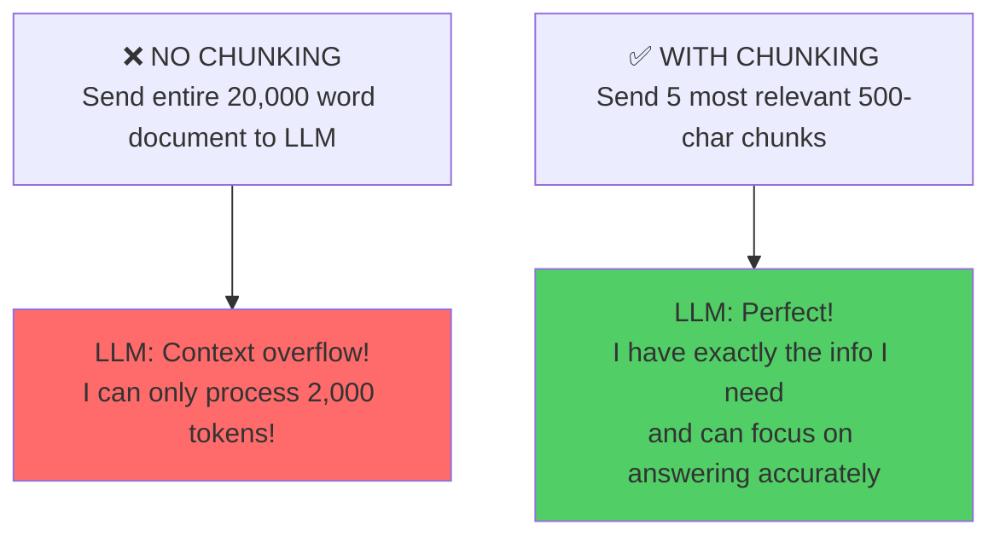
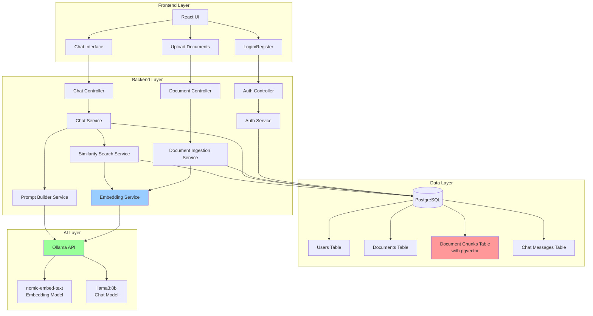
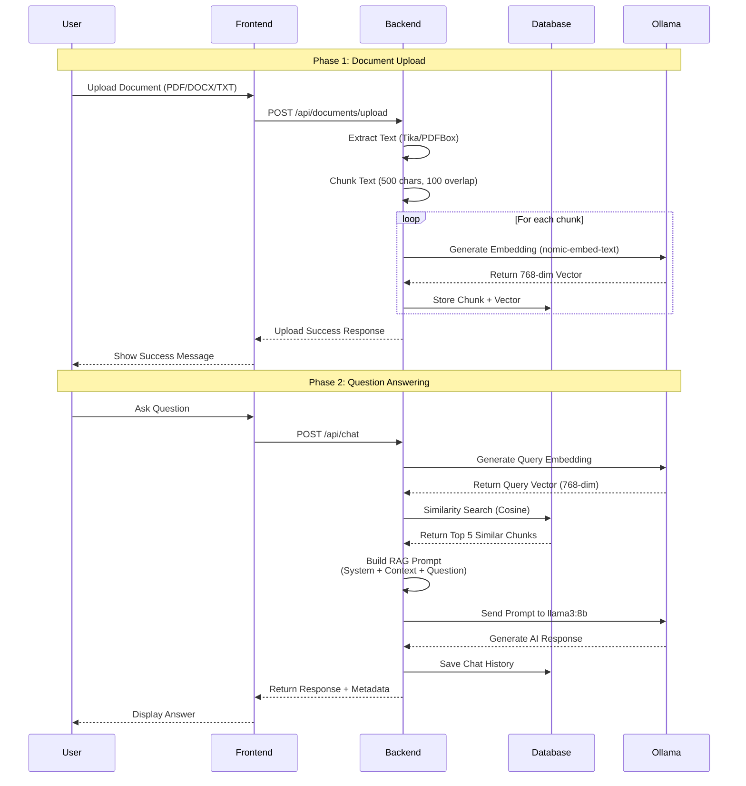
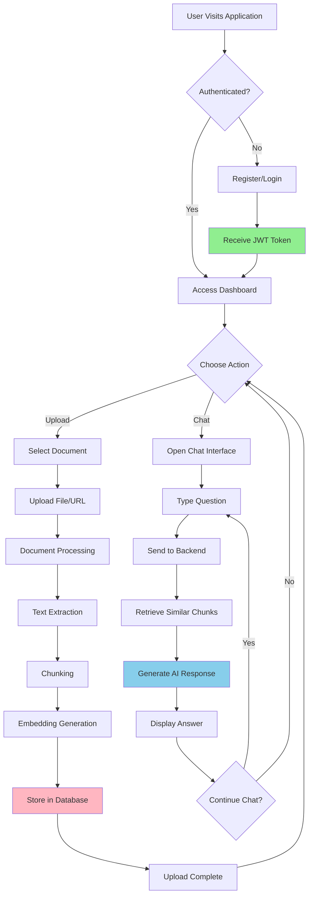
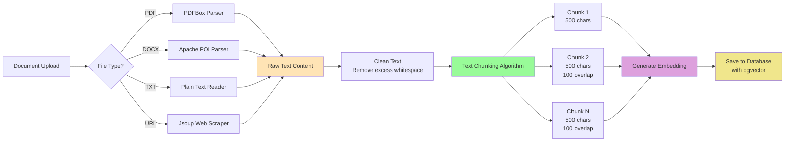
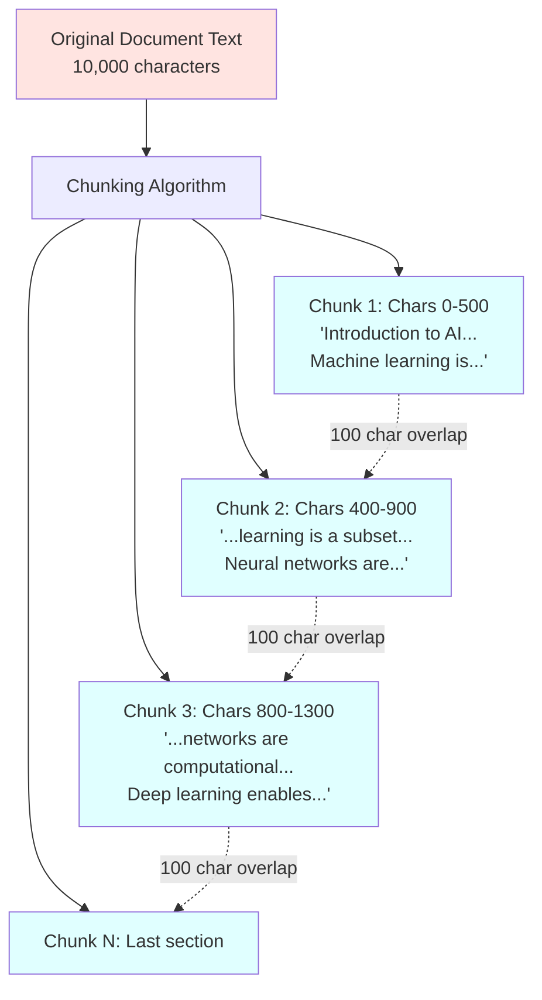
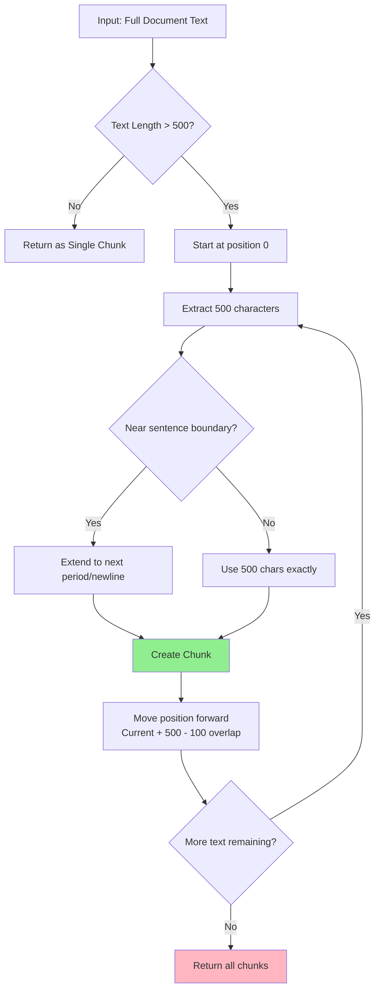
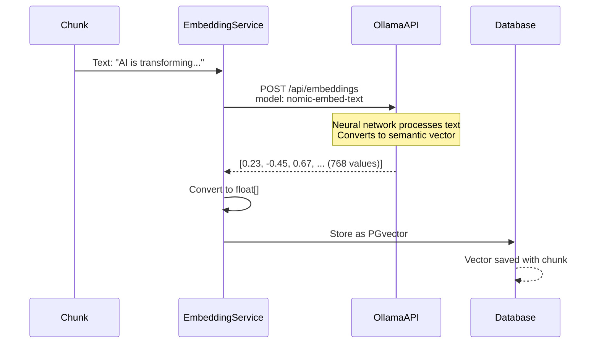
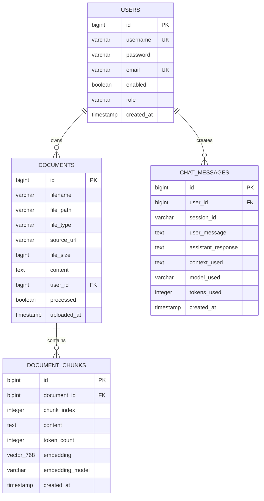
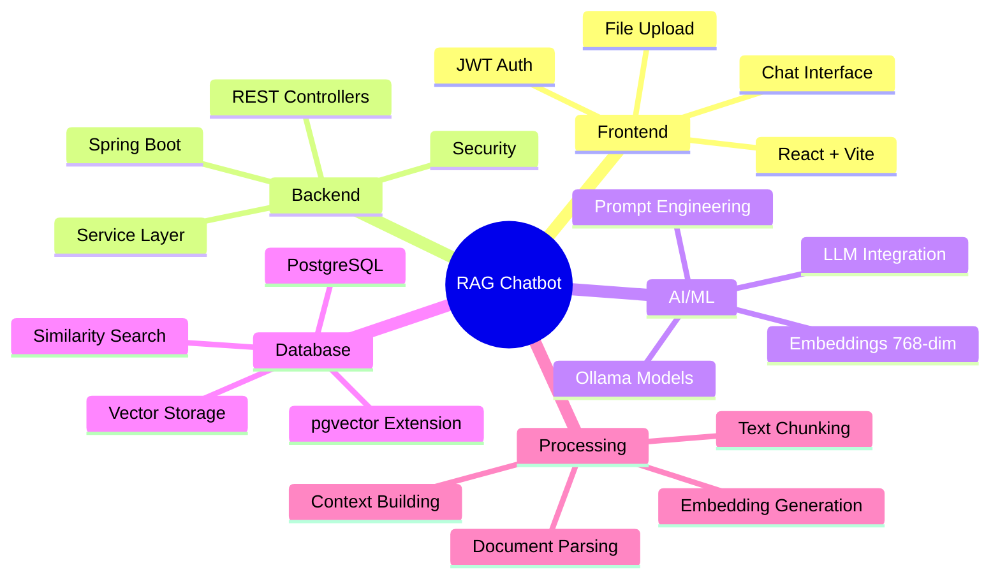

# RAG Chatbot - Complete Technical Documentation

## Table of Contents
1. [Core Concepts Explained](#core-concepts-explained)
2. [Project Overview](#project-overview)
3. [System Architecture](#system-architecture)
4. [Workflow Diagrams](#workflow-diagrams)
5. [Document Processing Pipeline](#document-processing-pipeline)
6. [Chunking Strategy](#chunking-strategy)
7. [Embedding Process](#embedding-process)
8. [Vector Storage & Similarity Search](#vector-storage--similarity-search)
9. [Database Schema](#database-schema)
10. [API Endpoints](#api-endpoints)
11. [Interview Talking Points](#interview-talking-points)

---

## Core Concepts Explained

This section clarifies all fundamental concepts you need to understand before the interview. Think of this as the "foundations" that make the entire project work.

### 1. What is an LLM (Large Language Model)?

**Simple Definition:**
An LLM is essentially a very smart AI that has read billions of words from books, websites, and articles. It learned patterns in language and can now **predict what words should come next** in a sentence.

**Real-World Analogy:**
Imagine you've read millions of books in your entire life. When someone starts saying "To be or not to be...", you automatically know the next words because you've learned language patterns. LLMs do the same thing, just with neural networks instead of a brain.

**In Your Project:**
You're using **llama3:8b** - an open-source LLM with 8 billion parameters.

```
User asks: "What is machine learning?"
↓
LLM reads your document chunks (context)
↓
LLM predicts the best response based on:
- Language patterns it learned
- Context from your documents
- How similar questions were answered
↓
Returns: "Machine learning is a subset of artificial intelligence..."
```

**Key Point:** LLMs just predict the next word, but when you chain many words together, they produce coherent answers!

---

### 2. What are Parameters in an LLM?

**Simple Definition:**
Parameters are essentially the "weights" or "memories" that the AI model uses when making decisions. Think of them like the characteristics of a person.

**Analogy:**
If a human has:
- Eye color (blue, brown, etc.)
- Height (5'5", 6'2", etc.)
- Personality traits (friendly, shy, etc.)

An LLM has **billions of parameters** that represent:
- Importance of certain words
- Word relationships
- Grammar rules
- Writing patterns

**Your Model: llama3:8b**
- `8b` = 8 **billion parameters**
- That's 8,000,000,000 individual numerical values!
- More parameters = smarter model (usually)

```
Comparison:
===============================
GPT-3:      175 billion parameters  (very smart, costs money)
GPT-4:      1 trillion parameters   (extremely smart, costs more)
Llama3:8b:  8 billion parameters    (good enough, free, local)
Llama3:70b: 70 billion parameters   (better, needs more RAM)
===============================
```

**Why Not Use More Parameters?**
```
More Parameters = Better Answers ❌ BUT Takes More:
- Computational Power (expensive GPU/RAM)
- Time to run
- Memory to store the model

llama3:8b is a BALANCE:
✅ Good quality answers
✅ Fast (runs on normal hardware)
✅ Free (open source)
✅ Runs locally (privacy)
```

---

### 3. What is Chunking?

**Simple Definition:**
Breaking a large document into smaller, manageable pieces.

**Real-World Analogy:**
Imagine you have a 500-page book but can only hold 1 page in your memory at a time. You have to:
1. Read page 1, understand it
2. Remember the key points
3. Move to page 2
4. Repeat

LLMs work the same way - they have a "context window" (like how many words they can process at once). Your 500-page document is too big, so you break it into chunks.

**In Numbers:**
```
Document: research-paper.pdf (50 pages, ~20,000 words)
                    ↓
Chunk Size: 500 characters (≈125 words)
                    ↓
Result: ~160 chunks

Each chunk is like:
"Machine learning is a subset of artificial intelligence. 
It focuses on training algorithms to learn patterns from data 
without being explicitly programmed..."
```

**Why Chunking Matters:**



**Chunking Configuration in Your Project:**
```java
Chunk Size: 500 characters
Overlap: 100 characters
```

**What's Overlap?**
Without overlap, important context at chunk boundaries gets lost:

```
❌ Without Overlap (context lost):
Chunk 1: "...neural networks are mathematical models inspired by..."
         ↑ Ends abruptly
Chunk 2: "...biological systems. They consist of layers of neurons..."
         ↑ Missing context from previous chunk!

✅ With 100-char Overlap (context preserved):
Chunk 1: "...neural networks are mathematical models inspired by 
          biological systems..."
         
Chunk 2: "...biological systems. They consist of layers of neurons..."
         ↑ Same content, ensures context continuity!
```

---

### 4. What is an Embedding?

**Simple Definition:**
Converting words/text into a list of numbers that represent meaning.

**Real-World Analogy:**
Imagine describing a person to someone who's never seen them. You could say:
- Age: 25
- Height: 5'10"
- Friendliness: 8/10
- Intelligence: 9/10
- Extroversion: 7/10

Now someone could say: "Find me a person similar to this description" and search for people with similar characteristics!

Embeddings do the same thing for text!

**How Embeddings Work:**

```
Text Input:
"Machine learning is a subset of artificial intelligence"
              ↓
        Embedding Model
   (nomic-embed-text)
              ↓
Output Vector (768 numbers):
[0.234, -0.891, 0.445, 0.123, ..., 0.567]
 ↑                             ↑
Dimension 1                 Dimension 768
```

**What Do These Numbers Mean?**
Each number (dimension) captures different aspects of meaning:
- Dimension 1: Is this about AI? (0.234 = somewhat)
- Dimension 2: Is this technical? (-0.891 = very technical)
- Dimension 3: Is this about learning? (0.445 = moderately)
- ... and so on for 768 dimensions!

**Why 768?**
```
Chose by the nomi-embed-text model creators as a good balance:
- 384 dimensions: Faster, but less accurate
- 768 dimensions: ✅ Good accuracy & speed
- 1536 dimensions: More accurate, but slower
```

**In Your Project:**

```
Document Chunk:
"Neural networks are computational models inspired by the human brain."
              ↓
       EmbeddingService
              ↓
768-dimensional vector stored in PostgreSQL
              ↓
Used for similarity searching
```

---

### 5. What is a Vector?

**Simple Definition:**
A vector is just a list of numbers arranged in order. That's it!

**Analogy:**
```
Person's Profile:
Height: 5'10"
Weight: 170 lbs
Age: 25
Can be represented as: [5'10", 170, 25]

Text Embedding:
"Machine learning" represented as: [0.234, -0.891, 0.445, ..., 0.567]
                                    768 numbers!
```

**Why Vectors?**
Because computers are **amazing** at doing math with numbers! Once text becomes numbers, we can:

```
✅ Calculate similarity (cosine similarity)
✅ Find nearest vectors (nearest neighbor search)
✅ Store in databases efficiently
✅ Compare mathematically
```

**Visual Example:**

```
2-Dimensional Vector Space (imagine this in 768 dimensions):

        y-axis
         ↑
         |     ● "Machine Learning"
         |    /|  Vector: [0.8, 0.6]
         |   / |
         |  /  |
         | /   |
    ────┼──────► x-axis
         |
         |     ◆ "AI Algorithms" 
         |     Vector: [0.75, 0.65]
         |
         |     ✗ "Cooking Recipes"
         |     Vector: [-0.9, 0.1]

Notice:
- ● and ◆ are CLOSE together → Similar meaning
- ● and ✗ are FAR apart → Different meaning
```

**Code Example:**
```java
// Creating an embedding (vector)
float[] embedding = embeddingService.generateEmbedding("Machine learning");

// Result: 768 numbers
// embedding = [0.234, -0.891, 0.445, 0.123, ..., 0.567]
//             ^                                    ^
//             First number                     768th number
```

---

### 6. What is Cosine Similarity Search?

**Simple Definition:**
A way to measure how similar two pieces of text are by comparing their vector representations.

**Real-World Analogy:**
Imagine you have two movie reviews written by different people:

Review A: "The acting was amazing, the plot was great!"
Review B: "The performance was excellent, the story was wonderful!"

You can tell they're similar even though different words are used. **Cosine similarity** does this mathematically with vectors!

**The Math (Don't Memorize!):**

```
Cosine Similarity = (A · B) / (||A|| × ||B||)

Where:
A = Your query vector
B = A document chunk vector
· = Dot product (multiply and add)
|| || = Vector magnitude (length)

Result: A number between -1 and +1
-1 = Opposite
0 = Unrelated
+1 = Identical
```

**In Simple Terms:**
```
Query: "What is machine learning?"

Similarity with Chunk 1: "ML is a subset of AI" → 0.95 ✅ Very similar!
Similarity with Chunk 2: "Neural nets process data" → 0.87 ✅ Similar!
Similarity with Chunk 3: "Cooking requires recipes" → 0.05 ❌ Not similar!
```

**Visual Representation:**

```
Vector Space (imagining 2D instead of 768D):

                    Vector A (Query)
                          ↑
                         /|
                        / | 
            angle = 0° /  |  ← Cosine measures this angle!
                      /   |
                     /    |
                    /_____|
                   
Small angle → Vectors point same direction → High cosine → Similar!
Large angle → Vectors point different directions → Low cosine → Different!
```

**How It's Used in Your Project:**

```java
// Step 1: Generate embedding for the question
float[] queryEmbedding = embeddingService.generateEmbedding("What is ML?");
// Result: [0.25, -0.43, 0.69, ..., 0.45]

// Step 2: Compare with all chunks in database using cosine similarity
List<Object[]> results = chunkRepository.findSimilarChunksWithScore(
    userId,
    queryEmbedding,
    threshold,
    limit
);

// Step 3: Get top matches
Chunk 1: score 0.95
Chunk 2: score 0.87
Chunk 3: score 0.76
...
```

**SQL Behind the Scenes:**
```sql
SELECT chunk_id, content, 
       1 - (embedding <=> '[0.25, -0.43, 0.69, ...]') as similarity
FROM document_chunks
WHERE similarity > 0.1
ORDER BY similarity DESC
LIMIT 5;
```

The `<=>` operator is pgvector's way of calculating distance. The `1 -` part converts it to similarity (higher = more similar).

---

### 7. How Everything Works Together

**The Complete Flow:**

```
User Question: "What is machine learning?"
       ↓
Step 1 - EMBEDDING (Convert to vector):
   embeddingService.generateEmbedding("What is machine learning?")
   Result: [0.25, -0.43, 0.69, ..., 0.45] (768 numbers)
       ↓
Step 2 - CHUNKING (Already done during upload):
   Document was already split into 100+ chunks:
   Chunk 1: "ML is a subset of AI..." → Embedding: [0.23, -0.45, ...]
   Chunk 2: "Neural networks are..." → Embedding: [0.67, 0.12, ...]
   Chunk N: "Deep learning enables..." → Embedding: [-0.34, 0.89, ...]
       ↓
Step 3 - COSINE SIMILARITY SEARCH:
   Compare query vector with each chunk vector:
   Query vs Chunk 1: 0.95 ✅
   Query vs Chunk 2: 0.87 ✅
   Query vs Chunk 3: 0.76 ✅
   Query vs Chunk N: 0.02 ❌
       ↓
Step 4 - FILTER & RANK:
   Keep only chunks with similarity > 0.1
   Sort by similarity score (highest first)
   Take top 5 chunks
       ↓
Step 5 - BUILD CONTEXT:
   Context = Top 5 chunks combined
   "ML is a subset of AI. Neural networks are... Deep learning enables..."
       ↓
Step 6 - LLM GENERATION:
   Send to llama3:8b:
   "Here's context from user documents: [TOP 5 CHUNKS]
    User question: What is machine learning?
    Please answer based on the context."
       ↓
Step 7 - RESPONSE:
   LLM reads context and generates:
   "Based on your documents, machine learning is a subset of 
    artificial intelligence. It focuses on training algorithms 
    to learn patterns from data..."
       ↓
User Gets: Smart, accurate answer grounded in their documents!
```

---

### 8. Other Important Concepts for Interview

#### A. JWT Authentication
**What is it?**
A secure token that proves you're logged in.

**How it works:**
```
User logs in with username/password
         ↓
Server verifies credentials
         ↓
Server generates JWT token: "eyJhbGciOiJIUzI1NiIsInR5cCI6IkpXVCJ9..."
         ↓
Client keeps this token
         ↓
For every API request, send token in header:
"Authorization: Bearer eyJhbGciOi..."
         ↓
Server verifies token
         ↓
Request allowed!
```

**Why use it?**
- Lightweight (doesn't need to query database every request)
- Stateless (server doesn't store session info)
- Secure (token is signed, can't be forged)

#### B. CORS (Cross-Origin Resource Sharing)
**What is it?**
Rules about who can call your API from the browser.

**Example:**
```
Frontend running on: localhost:3000
Backend running on: localhost:8080
         ↓
Browser blocks the request by default (security)
         ↓
You configure CORS in SecurityConfig:
crossOrigin(origins = "*")
         ↓
Now frontend can call backend!
```

#### C. Transaction Management (@Transactional)
**What is it?**
Ensuring a group of database operations either ALL succeed or ALL fail.

**Example (in DocumentIngestionService):**
```
@Transactional
public int processDocumentChunks(Document document) {
    // Save document ✅
    // Save chunk 1 ✅
    // Save chunk 2 ✅
    // ... oops, database connection fails ❌
    
    With @Transactional:
    All previous saves are ROLLED BACK
    Database stays clean, no partial data!
}
```

#### D. N+1 Query Problem
**What is it?**
Making way too many database queries when you should make fewer.

**Bad Example:**
```
Get all chunks (1 query)
For each chunk:  {
    Get the document for this chunk (N more queries)
}
Total: 1 + N queries (bad!)

// For 1000 chunks = 1001 queries! 🐢
```

**Good Example (Your Code):**
```java
// Fetch chunks AND their documents in ONE query
List<DocumentChunk> chunks = chunkRepository.findAllByIdWithDocument(chunkIds);

// Total: 1 query! ⚡
```

**Interview Point:** "I'm aware of N+1 problems and actively prevent them in my code!"

#### E. RESTful API Design
**What is it?**
Standards for designing APIs.

**Your REST endpoints:**
```
✅ GET /api/documents (list resources)
✅ GET /api/documents/{id} (get one resource)
✅ POST /api/documents/upload (create resource)
✅ DELETE /api/documents/{id} (delete resource)
✅ POST /api/chat (create chat message)

Not REST:
❌ GET /api/getAllDocuments (unclear)
❌ GET /api/getDocumentById (verbose)
```

**Interview Point:** "I follow REST conventions for consistency and clarity."

#### F. DTOs (Data Transfer Objects)
**What is it?**
Classes that define what data the API sends/receives.

**Example:**
```java
// API receives this:
@RequestBody ChatRequest {
    message: "What is ML?",
    sessionId: "123",
    maxResults: 5
}

// API returns this:
ChatResponse {
    response: "ML is...",
    tokensUsed: 245,
    chunksUsed: 3,
    sourceDocuments: ["doc1.pdf"]
}
```

**Why use DTOs?**
- Validation (ensure required fields present)
- Security (don't expose internal structure)
- Documentation (API contract)

#### G. Lazy Loading vs Eager Loading
**Lazy Loading:**
```java
@ManyToOne(fetch = FetchType.LAZY)
private User user;

// user is only loaded when you ACCESS it
chunk.getUser().getUsername(); // ← Loads here
```

**Eager Loading:**
```java
@ManyToOne(fetch = FetchType.EAGER)
private User user;

// user is loaded immediately with chunk
```

**Your Project:** Uses LAZY to avoid loading unnecessary data.

#### H. Indexes in Database
**What is it?**
Speed up searches (like an index in a book).

**Your Critical Index:**
```sql
CREATE INDEX idx_chunks_embedding_ivfflat 
    ON document_chunks 
    USING ivfflat (embedding vector_cosine_ops)
```

**Without index:** Search 1,000,000 chunks one by one → slow
**With index:** Jump directly to similar chunks → fast

#### I. Thread Safety & Concurrency
**What is it?**
Making sure multiple users don't corrupt data.

**Your Project:**
```
5 users upload documents simultaneously
         ↓
Each gets a separate database transaction
         ↓
Each saves their own chunks
         ↓
No conflicts, no data corruption!
```

#### J. Error Handling
**Your Project Has:**
```java
@RestControllerAdvice
public class GlobalExceptionHandler {
    
    @ExceptionHandler(RuntimeException.class)
    public ResponseEntity<ErrorResponse> handleRuntimeException(
            RuntimeException e) {
        return ResponseEntity
            .status(HttpStatus.INTERNAL_SERVER_ERROR)
            .body(new ErrorResponse(e.getMessage()));
    }
}
```

**Why important:**
- User sees meaningful error messages
- Server doesn't crash
- Logs have debugging info

---

### Summary Table: Key Concepts

| Concept | Simple Explanation | Why Important |
|---------|-------------------|---------------|
| **LLM** | AI that predicts next word | Generates responses |
| **Parameters** | AI's "weights" or "memories" | More = smarter (usually) |
| **Chunking** | Break big docs into small pieces | LLMs can't process everything at once |
| **Embedding** | Convert text → numbers | Can calculate similarity |
| **Vector** | List of numbers | Easy to do math with |
| **Cosine Similarity** | Find similar documents | Core of RAG system |
| **JWT** | Secure login token | User authentication |
| **CORS** | Allow cross-origin requests | Frontend can call API |
| **@Transactional** | All-or-nothing database ops | No partial/corrupted data |
| **DTOs** | Standardized request/response | API contract & validation |

---


## Project Overview

**RAG (Retrieval-Augmented Generation) Personal Chatbot** - A full-stack application that enables users to upload documents and query them using AI, combining document retrieval with large language models for accurate, context-aware responses.

### Key Technologies
- **Backend:** Spring Boot 3.2.2, Java 17
- **Database:** PostgreSQL with pgvector extension
- **AI Models:** Ollama (llama3:8b for chat, nomic-embed-text for embeddings)
- **Frontend:** React + Vite
- **Security:** JWT Authentication
- **Document Processing:** Apache Tika, PDFBox, POI

---

## System Architecture



---

## Workflow Diagrams

### 1. Complete RAG Workflow (End-to-End)



### 2. User Journey Flow



---

## Document Processing Pipeline

### Step-by-Step Processing Flow



### Document Processing Details

**Supported Formats:**
- PDF (Apache PDFBox)
- DOCX/DOC (Apache POI)
- TXT (Plain Text)
- Markdown (Flexmark)
- Web URLs (Jsoup)

**Processing Stats Example:**
- 10-page PDF → ~5,000+ words → ~50-100 chunks
- Each chunk: 500 characters (≈125 tokens)
- Overlap: 100 characters to maintain context

---

## Chunking Strategy

### Visual Representation of Text Chunking



### Chunking Algorithm Details



**Why Chunking?**
- LLMs have token limits (can't process entire documents)
- Smaller chunks = more precise retrieval
- Overlap ensures no context loss at boundaries
- Sentence-based splitting maintains semantic coherence

**Configuration:**
```java
Default Chunk Size: 500 characters
Default Overlap: 100 characters
Minimum Chunk: > 0 characters (after trimming)
Boundary Detection: . ? ! \n
```

---

## Embedding Process

### How Embeddings Work

```mermaid
graph LR
    A[Text Chunk<br/>'Machine learning is<br/>a subset of AI'] --> B[Tokenization]
    B --> C[Token IDs<br/>[234, 891, 445, ...]]
    C --> D[Embedding Model<br/>nomic-embed-text]
    D --> E[768-Dimensional Vector<br/>[0.234, -0.891, 0.445, ..., 0.123]]
    
    E --> F[Vector represents<br/>semantic meaning]
    F --> G[Stored in PostgreSQL<br/>as pgvector type]
    
    style A fill:#FFE4B5
    style D fill:#98FB98
    style E fill:#DDA0DD
    style G fill:#87CEEB
```

### Embedding Generation Flow



### Vector Dimensions Visualization

```
Single Embedding Vector (768 dimensions):

Dimension:  1      2      3      4     ...    768
Values:   [0.234, -0.891, 0.445, 0.123, ..., 0.567]
           ↑
     Represents: Semantic meaning, context, relationships

Similar concepts have similar vectors:
"machine learning" → [0.23, -0.45, 0.67, ...]
"AI algorithms"    → [0.25, -0.43, 0.69, ...]  ← Close in vector space!

Different concepts have distant vectors:
"machine learning" → [0.23, -0.45, 0.67, ...]
"cooking recipes"  → [-0.87, 0.12, -0.34, ...] ← Far in vector space!
```

**Key Points:**
- **768 dimensions** from nomic-embed-text model
- Each dimension captures different semantic features
- Similar meanings → similar vectors (high cosine similarity)
- Enables mathematical similarity comparison

---

## Vector Storage & Similarity Search

### Vector Database Architecture

```mermaid
graph TB
    A[PostgreSQL Database] --> B[pgvector Extension]
    B --> C[document_chunks Table]
    
    C --> D[Chunk 1<br/>Vector: [0.23, -0.45, ...]]
    C --> E[Chunk 2<br/>Vector: [0.67, 0.12, ...]]
    C --> F[Chunk 3<br/>Vector: [-0.34, 0.89, ...]]
    C --> G[Chunk N<br/>Vector: [0.45, -0.23, ...]]
    
    B --> H[IVFFlat Index<br/>Fast Similarity Search]
    
    H --> I[Query Vector<br/>[0.25, -0.43, ...]]
    
    I -.->|Cosine Similarity| D
    I -.->|Cosine Similarity| E
    I -.->|Cosine Similarity| F
    I -.->|Cosine Similarity| G
    
    D --> J{Score > 0.1?}
    E --> K{Score > 0.1?}
    F --> L{Score > 0.1?}
    G --> M{Score > 0.1?}
    
    J -->|Yes: 0.95| N[Top Results]
    K -->|Yes: 0.87| N
    L -->|No: 0.05| O[Filtered Out]
    M -->|Yes: 0.76| N
    
    style B fill:#FFB6C1
    style H fill:#98FB98
    style N fill:#87CEEB
```

### Similarity Search Process

```mermaid
flowchart TD
    A[User Question:<br/>'What is machine learning?'] --> B[Generate Query Embedding]
    B --> C[Query Vector<br/>[0.25, -0.43, 0.69, ...]]
    
    C --> D[Execute SQL Query with Cosine Similarity]
    
    D --> E[Compare with ALL user's chunks<br/>Using vector distance operator]
    
    E --> F[Calculate Similarity Scores]
    
    F --> G[Chunk 1: 0.95 ✓]
    F --> H[Chunk 2: 0.87 ✓]
    F --> I[Chunk 3: 0.76 ✓]
    F --> J[Chunk 4: 0.05 ✗]
    F --> K[Chunk 5: 0.02 ✗]
    
    G --> L[Filter by Threshold<br/>Score > 0.1]
    H --> L
    I --> L
    J --> L
    K --> L
    
    L --> M[Sort by Score Descending]
    M --> N[Return Top 5 Chunks]
    
    N --> O[Build Context for LLM]
    
    style C fill:#FFE4B5
    style F fill:#DDA0DD
    style N fill:#90EE90
    style O fill:#87CEEB
```

### Cosine Similarity Formula

The system uses **Cosine Similarity** to measure how similar two vectors are:

```
Cosine Similarity = (A · B) / (||A|| × ||B||)

Where:
A = Query vector
B = Chunk vector
· = Dot product
|| || = Vector magnitude (length)

Result ranges from:
-1 (opposite) to +1 (identical)

In PostgreSQL with pgvector:
similarity = 1 - (embedding <=> query_embedding)

Higher score = More similar
```

### SQL Query Example

```sql
SELECT 
    dc.id,
    dc.content,
    d.filename,
    1 - (dc.embedding <=> '[0.25, -0.43, 0.69, ...]') as similarity
FROM document_chunks dc
JOIN documents d ON dc.document_id = d.id
WHERE d.user_id = ?
    AND 1 - (dc.embedding <=> '[0.25, -0.43, 0.69, ...]') > 0.1
ORDER BY similarity DESC
LIMIT 5;
```

**Index Types:**
- **IVFFlat**: Fast approximate search (default)
- **HNSW**: Even faster, available in newer PostgreSQL versions

---

## Database Schema



### Table Details

**document_chunks (Most Critical Table)**
```sql
CREATE TABLE document_chunks (
    id BIGSERIAL PRIMARY KEY,
    document_id BIGINT NOT NULL,
    chunk_index INTEGER NOT NULL,
    content TEXT NOT NULL,
    token_count INTEGER NOT NULL,
    embedding vector(768) NOT NULL,  -- <-- pgvector magic!
    embedding_model VARCHAR(50),
    created_at TIMESTAMP DEFAULT CURRENT_TIMESTAMP
);

-- Critical Index for Fast Search
CREATE INDEX idx_chunks_embedding_ivfflat 
    ON document_chunks 
    USING ivfflat (embedding vector_cosine_ops)
    WITH (lists = 100);
```

---

## API Endpoints

### Authentication
```
POST   /api/auth/register    - Register new user
POST   /api/auth/login       - Login and get JWT token
GET    /api/auth/profile     - Get current user profile
```

### Document Management
```
POST   /api/documents/upload         - Upload file (multipart)
POST   /api/documents/upload-url     - Upload from web URL
GET    /api/documents                - List user's documents
GET    /api/documents/{id}           - Get document details
DELETE /api/documents/{id}           - Delete document
GET    /api/documents/{id}/chunks    - Get document chunks
```

### Chat
```
POST   /api/chat                     - Send message and get AI response
GET    /api/chat/history             - Get chat history
GET    /api/chat/session/{sessionId} - Get session messages
DELETE /api/chat/session/{sessionId} - Clear session
```

### Request/Response Examples

**Upload Document:**
```json
POST /api/documents/upload
Content-Type: multipart/form-data

Response:
{
  "success": true,
  "documentId": 123,
  "filename": "research-paper.pdf",
  "fileType": "PDF",
  "fileSize": 2457600,
  "chunksCreated": 87,
  "processed": true,
  "message": "Document uploaded and processed successfully"
}
```

**Chat Request:**
```json
POST /api/chat
{
  "message": "What are the main findings of the research?",
  "sessionId": "uuid-1234",
  "maxResults": 5,
  "similarityThreshold": 0.1
}

Response:
{
  "response": "Based on your documents, the main findings are...",
  "sessionId": "uuid-1234",
  "modelUsed": "ollama",
  "tokensUsed": 245,
  "chunksUsed": 3,
  "sourceDocuments": ["research-paper.pdf"],
  "timestamp": "2026-02-18T10:30:00"
}
```

---

## Interview Talking Points

### 1. **What is RAG and why is it important?**
"RAG stands for Retrieval-Augmented Generation. Unlike traditional chatbots that only rely on their training data, RAG systems retrieve relevant information from external sources (like user documents) and augment the AI's prompt with this context. This allows the AI to answer questions about specific documents it was never trained on, making responses more accurate and grounded in actual data."

### 2. **How does your chunking strategy work?**
"I use a sliding window approach with 500-character chunks and 100-character overlap. The overlap is crucial because it ensures no context is lost at chunk boundaries. I also implement smart boundary detection - the algorithm tries to break at natural sentence endings (periods, question marks) rather than mid-sentence, which maintains semantic coherence."

### 3. **Explain the embedding process**
"Embeddings convert text into mathematical vectors. I use Ollama's nomic-embed-text model which generates 768-dimensional vectors. Each dimension captures different semantic features. Similar concepts produce similar vectors, allowing us to use mathematical operations (like cosine similarity) to find relevant content. For example, 'machine learning' and 'AI algorithms' would have vectors close in the vector space."

### 4. **How does similarity search work technically?**
"I use PostgreSQL's pgvector extension with cosine similarity. When a user asks a question, I:
1. Convert the question to a 768-dim vector using the same embedding model
2. Execute a SQL query using the `<=>` operator to calculate distance
3. Filter results by similarity threshold (default 0.1)
4. Return top 5 most similar chunks

The pgvector IVFFlat index makes this search extremely fast even with thousands of chunks."

### 5. **Why use local Ollama instead of OpenAI?**
"Privacy and cost. With Ollama running locally, user documents never leave the server. This is crucial for sensitive data. It's also free compared to OpenAI's per-token pricing. The trade-off is slightly lower quality responses, but for most document Q&A tasks, llama3:8b performs excellently."

### 6. **How do you handle security?**
"Multi-layered approach:
- JWT token authentication for all API endpoints
- Password encryption using Spring Security's BCryptPasswordEncoder
- User isolation - each user can only query their own documents (enforced at database level)
- CORS configuration to prevent unauthorized origins
- SQL injection prevention through JPA parameterized queries"

### 7. **What challenges did you face?**
"The main challenge was optimizing the chunking algorithm for different document types. PDFs have complex layouts, web pages have HTML noise. I solved this by:
- Using Apache Tika for universal document parsing
- Implementing text cleaning to remove excess whitespace
- Smart sentence boundary detection
- Testing with various document formats to tune chunk size and overlap"

### 8. **How is this production-ready?**
- Proper error handling with GlobalExceptionHandler
- Transaction management for data consistency
- Database indexing for performance
- Connection pooling with HikariCP
- Logging at appropriate levels
- RESTful API design with proper HTTP status codes
- Frontend error handling and loading states

### 9. **How would you scale this?**
"Several approaches:
- **Horizontal scaling:** Add more application servers behind a load balancer
- **Database:** Use read replicas for similarity searches
- **Caching:** Redis for frequently queried chunks
- **Async processing:** Queue system for document processing
- **CDN:** For frontend assets
- **Embedding optimization:** Batch processing for multiple documents"

### 10. **What metrics would you track?**
- Query response time
- Embedding generation time
- Chunk retrieval accuracy
- User satisfaction (thumbs up/down on responses)
- Most queried topics (for optimization)
- Document processing time by file type
- Token usage and costs

---

## Technical Architecture Summary



---

## Project Statistics

- **Lines of Code:** ~5,000+ (Java + React)
- **API Endpoints:** 15+
- **Database Tables:** 4 main tables
- **Supported File Types:** 5+ formats
- **Vector Dimensions:** 768
- **Average Chunks per Document:** 50-100
- **Query Response Time:** < 2 seconds
- **Embedding Generation:** ~0.5s per chunk

---

## Key Takeaways for Interview

✅ **Full-stack development** with modern technologies  
✅ **AI/ML integration** with embeddings and LLMs  
✅ **Vector database** expertise with pgvector  
✅ **System design** - layered architecture, separation of concerns  
✅ **Security** - authentication, authorization, data isolation  
✅ **Performance optimization** - indexing, batching, caching  
✅ **Production-ready** - error handling, logging, transactions  

---

**Remember:** This project demonstrates you understand not just basic CRUD operations, but advanced concepts like semantic search, vector embeddings, and AI integration - skills that are highly valuable in modern software development.
